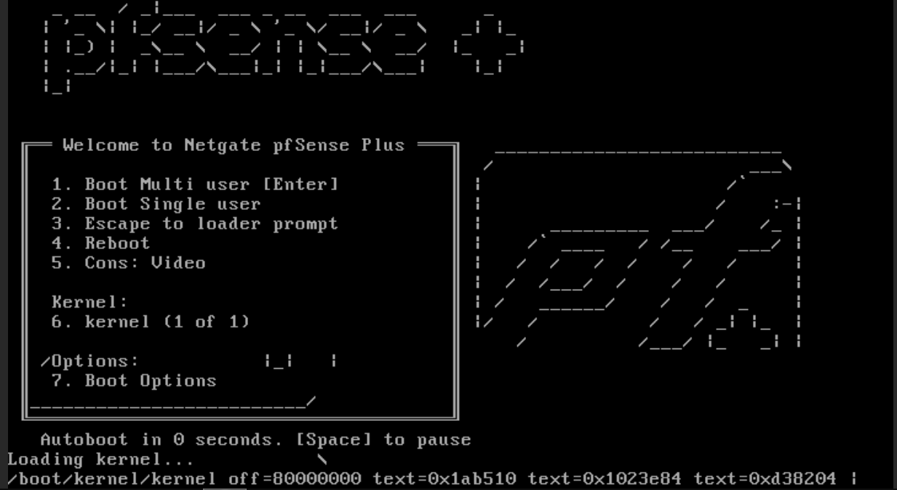

# Tp-Mise en place d'une architecture DMZ

Bts sio 2

Moskalik

Thomas

## 1. Topologie et Architecture Réseau Retenue

## **1.1 Architecture physique et virtuelle**

L'infrastructure s'appuie sur l'hyperviseur Proxmox VE en séparant strictement les flux sur trois commutateurs virtuels (Linux Bridges) :   

• **`vmbr0` (WAN)** : Pont physique branché sur l'interface de la salle de cours. Il simule le réseau public Internet.   
• **`vmbr40` (LAN)** : Pont virtuel isolé, dédié aux postes clients internes.   
• **`vmbr50` (DMZ)** : Pont virtuel isolé, réservé aux serveurs publics 

## 1.2 Tableau d'adressage IP

| Zone / Interface | Pont Proxmox | Interface pfSense | Réseau / CIDR | IP pfSense | Mode IP |
| --- | --- | --- | --- | --- | --- |
| WAN | vmbr0 | vtnet0 | 192.168.20.0/24 | 192.168.20.176 | DHCP |
| LAN | vmbr40 | vtnet1 | 192.168.10.0/24 | 192.168.10.254 | Statique |
| DMZ | vmbr50 | vtnet2 | 192.168.30.0/24 | 192.168.30.254 | Statique |

**Création de la machine virtuelle sur Proxmox** :

Ajout ordonné des trois interfaces réseau :

Carte 1 (`net0`) reliée à `vmbr0` (WAN).   
Carte 2 (`net1`) reliée à `vmbr40` (LAN).   
Carte 3 (`net2`) reliée à `vmbr50` (DMZ).   

**Installation de pfSense CE** :

Amorçage sur l'image d'installation, sélection du système de fichiers ZFS en schéma GPT standard.

Déploiement de la version communautaire stable pfSense CE 2.9.0.



**Assignation initiale et configuration IP en console** :

Attribution des interfaces : `vtnet0` vers WAN, `vtnet1` vers LAN, et `vtnet2` vers OPT1.

Le WAN obtient son IP dynamique `192.168.20.176/24` fournie par le routeur de la salle.   

L'interface LAN reçoit l'IP fixe `192.168.10.254/24` sans serveur DHCP.   L'interface OPT1 reçoit l'IP fixe `192.168.30.254/24` sans serveur DHCP.


Initialisation du poste d'administration & Interface WebGUI:

Connectez la machine cliente sur le réseau Proxmox **`vmbr40`**


Configurez manuellement sa carte réseau :

**Adresse IP** : `192.168.10.10`

**Masque** : `255.255.255.0` (`/24`)

**Passerelle** : `192.168.10.254`

**DNS** :  l'adresse IP de pfSense (`192.168.10.254`)


Testez la connectivité vers la passerelle :


Ouvrez le navigateur Web à l'adresse : `[https://192.168.10.254](https://192.168.10.254)`

Acceptez le certificat de sécurité auto-signé.

Identifiants d'origine : Utilisateur `admin`, mot de passe `pfsense`.

Suivez l'assistant de démarrage (Wizard) pour redéfinir un mot de passe sécurisé.


**Configuration générale et résolution de noms (Wizard)** :   
• **Nom de la machine (Hostname)** : `pfsense` (ou `fw-vikor`)   
• **Domaine d'entreprise** : `vikor.lan`
   
• **Serveurs DNS amont** : `1.1.1.1` et `8.8.8.8`
   
• **Option Override DNS** : activée afin d'hériter de la passerelle DNS distribuée sur l'accès WAN du site d'interconnexion. 

Action à réaliser sur pfSense:

**Renommer l'interface DMZ** :
• Allez dans le menu **Interfaces** > **OPT1**.   
• Cochez la case **Enable interface**.
• Changez le champ **Description** : remplacez `OPT1` par **`DMZ`**.   
• Cliquez sur **Save**, puis sur **Apply Changes**.


**Autoriser le trafic privé sur le WAN (Critique en TP)** :

Allez dans **Interfaces** > **WAN**.   
Descendez tout en bas de la page dans la section *Reserved Networks*.
**Dédochez** l'option **Block private networks and loopback addresses**.
(Explication technique pour l'astreinte : cette règle RFC 1918 bloque par défaut les flux entrants issus de réseaux privés. Le WAN étant simulé sur la plage `192.168.20.0/24`, son maintien bloquerait toutes les connexions venant de l'extérieur).   
Cliquez sur **Save**, puis sur **Apply Changes**.


Déploiement et intégration du serveur Web DMZ:

Je prend un serveur Lamp sur proxmox que je configure:


Rendre le site accessible depuis Internet (Accès WAN -> Serveur DMZ)

Allez dans **Firewall** > **NAT** > onglet **Port Forward**.Cliquez sur **Add** (flèche vers le haut) et configurez les champs :
• **Interface** : `WAN`
• **Address Family** : `IPv4`
• **Protocol** : `TCP`
• **Destination** : `WAN address`
• **Destination port range** : Choisir `HTTP` (port 80)
• **Redirect target IP** : `192.168.30.10`
• **Redirect target port** : `HTTP` (port 80)
• **Description** : `Redirection Web Vikor DMZ`
 .Cliquez sur **Save** puis **Apply Changes**.


Rendre le site accessible depuis le réseau interne (Accès LAN -> Serveur DMZ)

- Allez dans **Firewall** > **Rules** > onglet **LAN**.
- Par défaut, la règle « *Default allow LAN to any rule* » laisse passer tout le trafic initié par le LAN. Le poste client peut donc d'ores et déjà interroger `[http://192.168.30.10](http://192.168.30.10)`.
- Pour un cloisonnement strict recommandé, on restreint le flux :
    - **Action** : Pass
    - **Interface** : LAN
    - **Address Family** : IPv4
    - **Protocol** : TCP
    - **Source** : `LAN net`
    - **Destination** : `Single host or alias` -> `192.168.30.10`
    - **Destination Port Range** : `HTTP (80)`
    
    
    

Sécurisation et cloisonnement de la DMZ (Isolation DMZ -> LAN)

Le principe fondamental d'une DMZ est qu'en cas d'intrusion sur le serveur Web, l'attaquant ne doit en aucun cas pouvoir rebondir sur le LAN.   
• Allez dans **Firewall** > **Rules** > onglet **DMZ**.
• Ajoutez une règle d'interdiction vers le LAN :
    ◦ **Action** : `Block` (ou `Reject`)
    ◦ **Interface** : `DMZ`
    ◦ **Protocol** : `Any`
    ◦ **Source** : `DMZ net`
    ◦ **Destination** : `LAN net`
    ◦ **Description** : `Interdiction DMZ vers LAN`


   
• En dessous, autorisez la DMZ à contacter l'extérieur (pour les mises à jour logicielles de la machine):
    ◦ **Action** : `Pass`
    ◦ **Interface** : `DMZ`
    ◦ **Protocol** : `Any`
    ◦ **Source** : `DMZ net`
    ◦ **Destination** : `Any`
• Cliquez sur **Save** puis **Apply Changes**.


Test: 

Depuis votre machine hôte physique

- Ouvrez un navigateur Web.
- Tapez l'adresse IP de l'interface **WAN** de pfSense :

```jsx
http://192.168.20.176
```

